# 👨‍🌾🚜 FarmRPG Plus

This userscript its a collection of navigation, visual and informational features I thought would be a good fit for the player's experience.

Inspired by:
- [@anstosa](https://farmrpg.com/#!/profile.php?user_name=anstosa) - [farmrpg-farmhand](https://github.com/anstosa/farmrpg-farmhand/tree/main)
- [@coderanger](https://farmrpg.com/#!/profile.php?user_name=coderanger) - [farmrpg-etx](https://github.com/coderanger/farmrpg-ext)

Any feedback, ideas, requests, bugs or tips can be send to my ingame DM and Mailbox [@Synogun](https://farmrpg.com/#!/profile.php?user_name=Synogun)

All changes are documented on the [Changelog](CHANGELOG.md).

## 🤔💭 Considerations

> X. Cheating may be subject to an immediate ban.\
> (A) Do not use any form of botting, scripting, macros, etc. Just don’t. While FarmRPG is non-competitive, using any sort of hardware device, script, bot, macro, etc to play the game in an automated fashion is strictly forbidden. Do not discuss this topic in any public forum within the FarmRPG platform. Automation in the game causes a large amount of server requests and bandwidth usage that can impact game play for the entire community.

The userscript strictly follows the game's [Code Of Conduct](https://farmrpg.com/#!/coc.php), therefore, not automating or performing any actions in place of the player.

This userscript its not an official part of the Farm RPG.\
*Magic & Wires LLC.* are not responsible in any way for the errors introduced by this userscript and along with the game staff should not be bother in any way about it, for contact refer to [section above](#-farmrpg-plus).

## 💾 About data saved

The script saves data in the browser's local storage, which is not shared between devices or browsers.\
This means that if you switch browsers or devices, your data will not be carried over.

All data saved is related to the script's features and settings, such as:
- Features enabled/disabled
- Settings for each feature
- Cached data for performance improvements

Know that the script does not save any personal data, such as your FarmRPG account information or any other sensitive data.

### If any script feature seems broken, try resetting the it's data by going to the settings page and clicking on "Reset FarmRPG Plus Data". This will clear all saved data and restore the script to its default state.

## ⬇ How to Install and Use

## 💻 Setting Up on Desktop

To install the script on desktop, follow these steps:

- **Step 1: Use a compatible browser**  
    Choose a browser that allows extensions. Firefox is a great option and works on both desktop and mobile.

- **Step 2: Install a userscript manager**  
    Add an extension like **Violentmonkey** / **Tampermonkey**, or if you're on iOS, try **Userscripts**.

- **Step 3: Add the FarmRPG Plus script**
  - Access the script file [dist/FarmRPGPlus.user.js](https://raw.githubusercontent.com/Synogun/FarmRPGPlus/refs/heads/develop/dist/FarmRPGPlus.user.js)
  - Click Install or Add Script in your userscript manager.

## ✨ Features

### ⚙ Modular Features

All features can be turned ON/OFF independently and sometimes carries additional settings, you can check it out in-game:
> [My Settings -> Change Game Options](https://farmrpg.com/#!/settings_options.php) -> FarmRPG Plus Settings (at the bottom of the page)

- 

    
Screenshots

    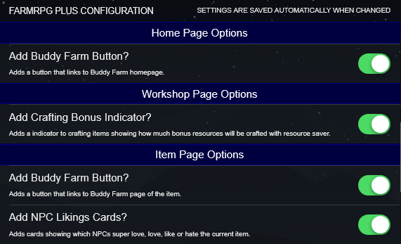

### 📚 Buddy Farm and Library Buttons

There's a ton of Buddy Farm and Library buttons throughout the game pages.
Each button can be enabled/disabled independently.

- Configurations:
  - **Enable Buddy Farm Button**: Enable or disable the Buddy Farm button.
  - **Enable Library Button**: Enable or disable the Library button.
  - **Show On Home Page**: Show or hide the buttons on the home page.
  - **Show On Item Page**: Show or hide the buttons on the item page.
  - **Show On Quests Page**: Show or hide the buttons on the quests page.
  - **Show On Quest Page**: Show or hide the buttons on the quest page.
  - **Show On NPC Page**: Show or hide the buttons on the NPC page.
  - **Show On Wishing Well Page**: Show or hide the buttons on the wishing well page.
  - **Show On Vault Page**: Show or hide the buttons on the vault page.
  - **Show On Event Pages**: Show or hide the buttons on the event pages (Configured on the event settings).
- 

    
Screenshots

    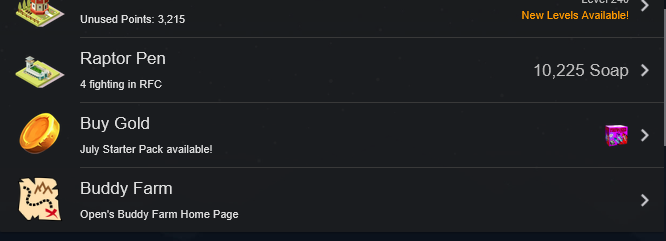

    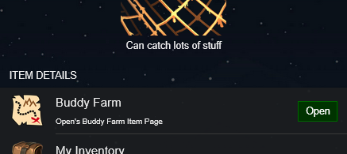

### ♻ Crafting Bonus Indicator

Adds a crafting bonus indicator on the items of Workshop page, showing how much bonus resources will be crafted with the resource saver perk.

- Configurations:
  - **Enable Crafting Bonus Indicator**: Enable or disable the feature.
  - **Show Only If Bonus Greater Than Zero**: Show the indicator only if the bonus is greater than zero.
- 

    
Screenshots

    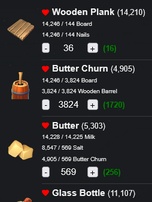

### ✅ Items Collected Indicator

Adds a small indicator on item page next to the image, indicating if the item has been collected along the game or not.
The indicator synchronizes whenever navigating to the museum page, inventory page or item page (and quantity on hand/in storage its greater than zero).

- Configurations:
  - **Enable Items Collected Indicator**: Enable or disable the feature.
  - **Show If Collected**: Show the indicator if the item has been collected.
  - **Show If Not Collected**: Show the indicator if the item has not been collected.

- 

    
Screenshots

    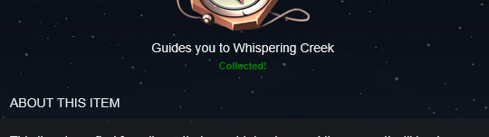

    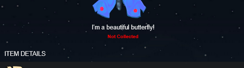

### 👥🎁 NPC Likings Card

Adds a card on item pages showing the NPCs that super loves, loves, likes or hates that item.

- Configurations:
  - **Enable NPC Likings Card**: Enable or disable the feature.
  - **Show Super Loves**: Show or hide the NPCs that super loves the item.
  - **Show Loves**: Show or hide the NPCs that loves the item.
  - **Show Likes**: Show or hide the NPCs that likes the item.
  - **Show Hates**: Show or hide the NPCs that hates the item.

- 

    
Screenshots

    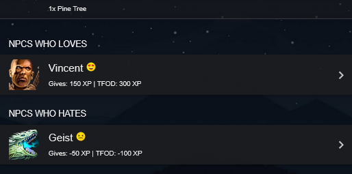

### 🥤🎃 Pumpkin Juice Goal Indicator

Modifies the Pumpkin Juice button to show the amount of Pumpkin Juice needed to reach the next mastery tiers for the item.

- Configurations:
  - **Enable Pumpkin Juice Indicator**: Enable or disable the feature.
  - **Show Amount For Mastery**: Show or hide the amount to reach Mastery (M) tier for the item.
  - **Show Amount For Grand Mastery**: Show or hide the amount to reach Grand Mastery (GM) tier for the item.
  - **Show Amount For Mega Mastery**: Show or hide the amount to reach Mega Mastery (MM) tier for the item.

- 

    
Screenshots

    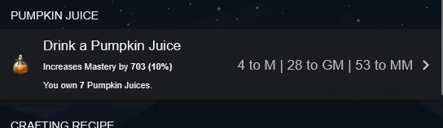

### 🔥 Oven Navigation Buttons

Adds a previous and next button inside the Ovens page, making cooking actions less painfull while not having the group actions buttons.

- Configurations:
  - **Enable Oven Navigation Buttons**: Enable or disable the feature.
  - **Show Previous Button**: Show or hide the previous button.
  - **Show Next Button**: Show or hide the next button.

- 

    
Screenshots

    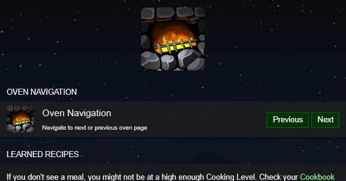

### 🏢💰 Vault Guesser Button

Adds a button to the Vault page that guesses the next code try based on the amount of tries done (Still in very early stages, but follows the general strategy: 0123 -> 4567 -> 89).

- Configurations:
  - **Enable Vault Guesser Button**: Enable or disable the feature.
- 

    
Screenshots

    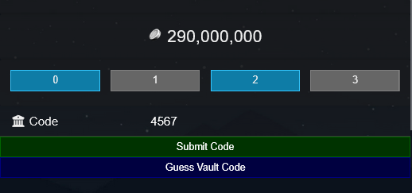

### ➗ Farm Supply Discount Indicator

Calculates the discount factor for perks on SALE and adds a label next to the buy button.

- Configurations:
  - **Enable Farm Supply Discount Indicator**: Enable or disable the feature.

- 

    
Screenshots

    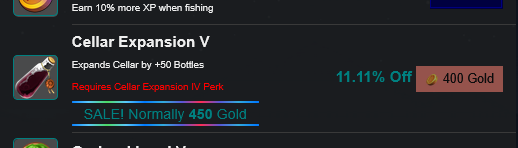

### 📅 Event Features

> [!NOTE]
> The following features are only available during events although they can be enabled/disabled at any time.

#### 🚀 Bottle Rocket Brawl

Display statistics about the attacks made and tokens earned, also, adds two history lists, one for attack history and one for last players attacked. The size of history logs can be set in the settings.

- Configurations:
  - **Enable Bottle Rocket Brawl**: Enable or disable the feature.
  - **Show Attack Stats**: Show or hide the event/attacks statistics.
  - **Show Attack History**: Show or hide the attack history.
  - **Attack History Size**: Set the number of attacks to show in the attack history.
  - **Show Player History**: Show or hide the player history.
  - **Player History Size**: Set the number of players to show in the player history.

- 

    
Screenshots

    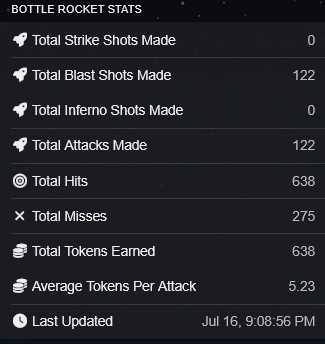

    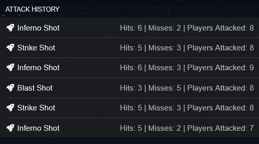

    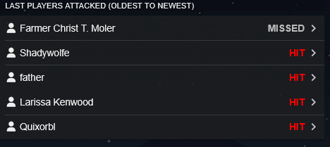

